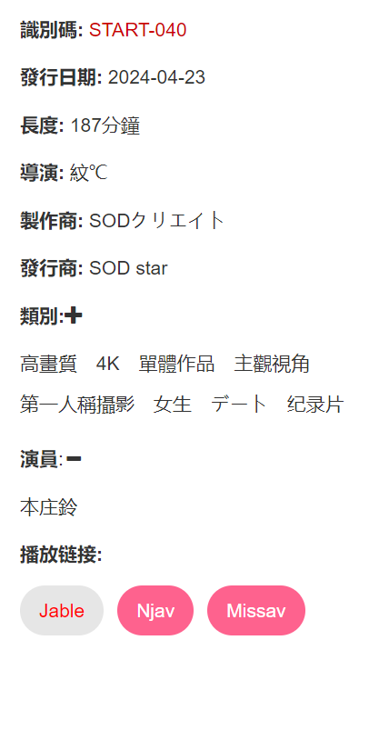
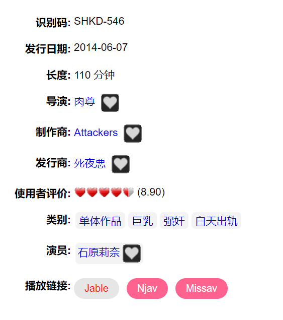

### 把Jav网站连接起来！
一个chrome插件
#### 功能
- 给Jav网站添加播放链接和db链接
  

    
    
  

#### 使用方法
1. 下载当前项目
2. 打开[扩展程序页面](chrome://extensions/)
3. 右上角勾选开发者模式
4. 加载已解压的扩展程序 -> 选择文件夹

#### 开发引导
支持新的网址：
  manifest.json
    content_scripts
      matches 添加网址匹配

Platform：运行本插件的平台
Provider：提供数据源的网站

使用vite打包：
  npm run build